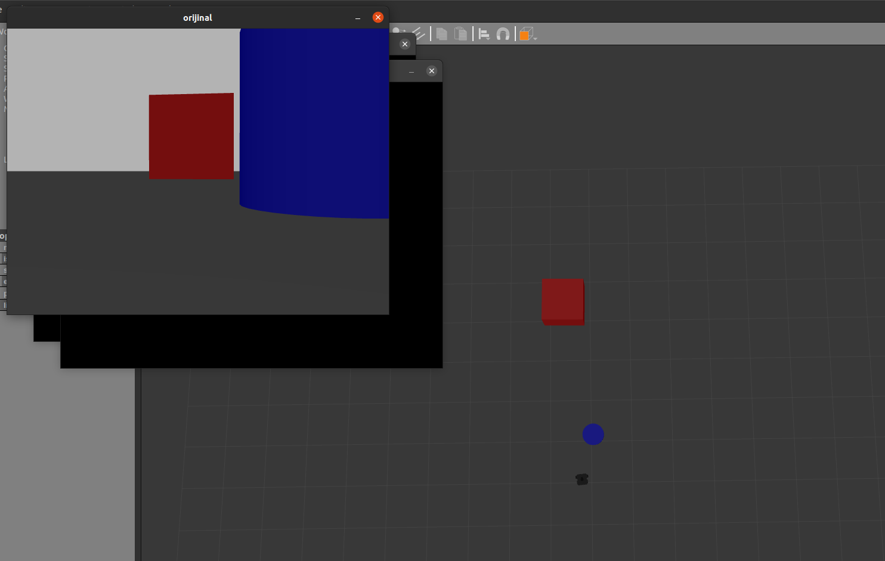
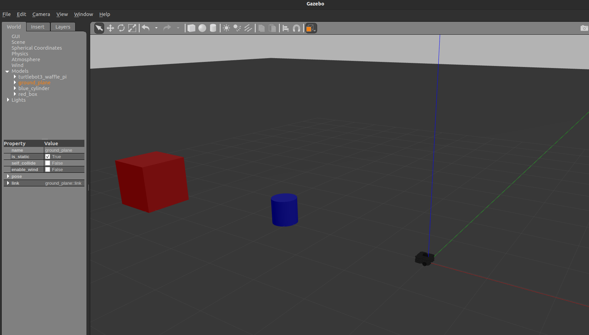

# A "very" simple approach to obstacle avoiding in ROS

---

## Description

A simple obstacle avoiding robot using LIDAR on a Turtlebot. This project was made as a practice for basic ROS and path planning concepts such as ros-topics, reading LIDAR data, object following, and simulating robots in Gazebo.
The goal was to make a robot:

- Detect goal using OpenCV.

- Read data from the 360° LiDAR scanner.

- Process the data in order to find any obstacles in the robot's path.

- Steer the robot into the right direction.

\*This code is intended to work in a ROS package, it has to be put in an existing package, or a tailor made one.

